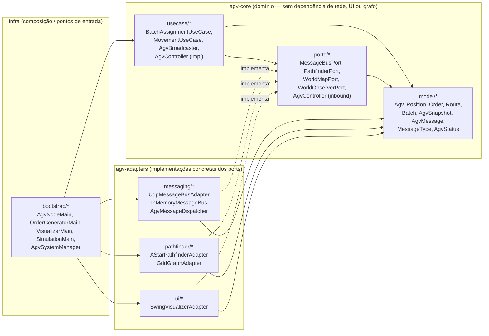
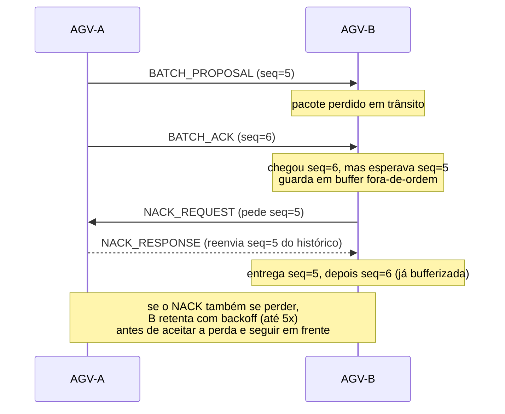
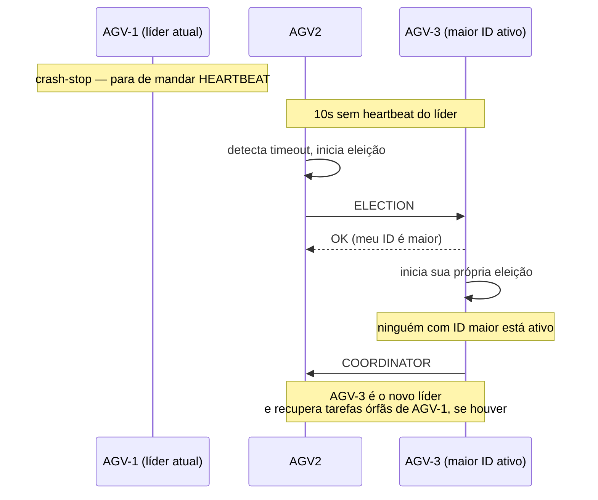
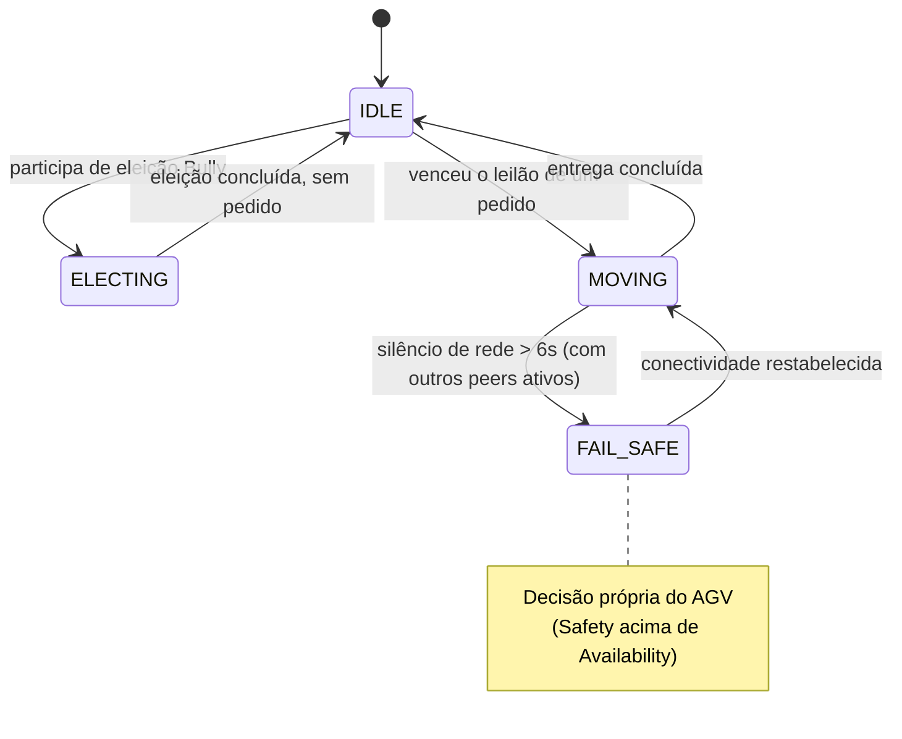
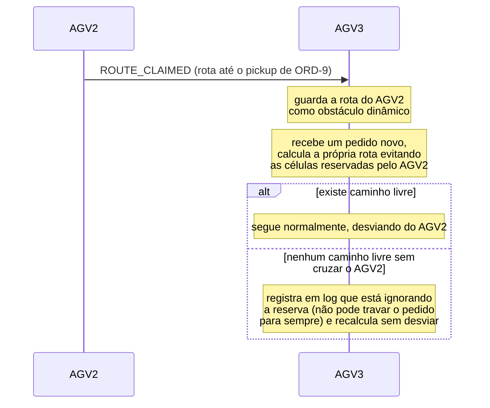

# Arquitetura e Decisões de Projeto — EP_DSID

Este documento explica **o que cada arquivo do projeto faz**, **por que ele existe** e **por que as decisões técnicas foram tomadas dessa forma**, amarrando cada escolha aos conceitos de Sistemas Distribuídos vistos na disciplina (Tanenbaum). O objetivo é apresentar o raciocínio por trás do sistema, não só descrevê-lo.

Para o *o quê* formal (requisitos, protocolo, formato de mensagem), a fonte da verdade é `Especificacao_Grupo15.pdf`. Este documento aqui é o *como* e o *por quê* da implementação.

---

## 1. Visão geral em uma frase

Uma frota de AGVs decide sozinha — sem servidor central — quem pega qual pedido, coordenando-se por **UDP Multicast** com um protocolo próprio de confiabilidade (SRM), eleição de líder (Bully) e um algoritmo de leilão determinístico que dispensa troca extra de mensagens.

## 2. Por que Arquitetura Hexagonal (Ports & Adapters)

A decisão mais estrutural do projeto foi separar **regra de negócio** (como um AGV decide o que fazer) de **detalhe técnico** (como essa decisão trafega pela rede, é desenhada na tela, ou vira um caminho no grid). O motivo é prático, não acadêmico: o professor e o próprio grupo já cogitaram, em algum momento, trocar a simulação por hardware real, trocar o Swing por outra UI, ou testar a lógica sem precisar abrir sockets de verdade. Se a lógica de negócio dependesse diretamente de `DatagramSocket` ou de `JFrame`, nenhuma dessas trocas seria possível sem reescrever o núcleo.

Prova de que isso não é só teoria: o projeto **já tem duas implementações reais** de `MessageBusPort` (`UdpMessageBusAdapter` para rede de verdade, `InMemoryMessageBus` para o modo sandbox) e o mesmo `BatchAssignmentUseCase`/`MovementUseCase` funciona com qualquer uma das duas, sem nenhuma alteração.

A seta pontilhada (`-.implementa.->`) é o ponto-chave: os adapters **dependem** do core (implementam suas interfaces), nunca o contrário. O core não sabe que UDP, Swing ou JGraphT existem.

---

## 3. Passeio por cada arquivo

### 3.1 `agv-core/model` — o vocabulário do domínio

| Arquivo | O que é | Decisão e por quê |
|---|---|---|
| `Position.java` | `record(int x, int y)` com `manhattanDistanceTo` e `orthogonalNeighbors` | **Record**, não classe: posição é um valor imutável, não uma entidade — dois `Position(2,3)` são o mesmo valor, não precisam de identidade. Manhattan (não euclidiana) porque o robô só anda em linha reta nos eixos do grid (sem diagonal, conforme especificação). |
| `AgvStatus.java` | `enum {IDLE, ELECTING, MOVING, OFFLINE, FAIL_SAFE}` | Cada status é um estado observável do sistema, não um detalhe interno — é isso que aparece no Visualizador e que outros AGVs recebem via heartbeat. `FAIL_SAFE` existe separado de `OFFLINE` porque são causas diferentes: `OFFLINE` é "não vejo mais esse peer" (visto de fora); `FAIL_SAFE` é "eu mesmo decidi parar por segurança" (decisão própria do AGV). |
| `Agv.java` | Entidade central: nome estático, UUID de sessão, posição, status, pedido atual, relógio de Lamport | O `agvId` é `staticName + "-" + sessionUuid` — ver seção 4.6 (Nomeação) para o porquê. `currentPosition`/`status` são `volatile`: são lidos pela thread de heartbeat e escritos pela thread de movimento e pelo monitor de liderança — sem `volatile` não há garantia de que uma thread enxergue a escrita da outra a tempo (isso é especialmente crítico para o Fail-Safe: se a thread de movimento não enxergar a transição, o robô continuaria andando mesmo "parado"). O relógio de Lamport tem métodos `synchronized` porque ele precisa de leitura-incremento atômicos (`incrementAndGetLamportClock`), não só visibilidade. |
| `Order.java` | `record(orderId, pickup, delivery)` | Puro dado, sem comportamento — o Gerador de Pedidos é stateless e só produz esses valores. |
| `Route.java` | `record(routeId, waypoints)` com `destination()` | Guarda a lista de posições calculada pelo A* — é o "contrato" entre `PathfinderPort` (quem calcula) e `MovementUseCase` (quem executa). |
| `Batch.java` | `record(batchId, orders, agvStates)` | O `agvStates` é o **snapshot** citado na especificação (RF4): um retrato do estado de todos os AGVs no instante da proposta. É isso que permite que todo mundo calcule o mesmo vencedor **sem trocar mais mensagens** — replicação de máquina de estado na prática. |
| `AgvSnapshot.java` | `record(agvId, position, status, lastSeen)` | Separado de `Agv` de propósito: é uma **cópia congelada** num instante (usada dentro do `Batch`), enquanto `Agv` é o estado vivo e mutável do próprio nó. Confundir os dois quebraria o determinismo do leilão (o estado vivo muda enquanto o lote ainda está sendo processado). |
| `AgvMessage.java` | `record` com `senderId, sequenceNumber, lamportTimestamp, type, payload` + fábricas estáticas por tipo | Corresponde exatamente ao cabeçalho obrigatório da especificação (seção VI.C). `payload` é `Map<String,Object>` (não um tipo por mensagem) porque o Jackson serializa isso de forma genérica sem precisar de uma hierarquia de classes por `MessageType` — simplicidade em troca de tipagem forte no payload (mitigado pelas fábricas estáticas, que centralizam o formato de cada tipo num único lugar). |
| `MessageType.java` | `enum` com todos os tipos de mensagem do protocolo | Espelha a seção VI.B da especificação 1:1 — é o "enum que documenta o protocolo". |

### 3.2 `agv-core/ports` — os contratos com o mundo exterior

| Arquivo | Direção | Decisão e por quê |
|---|---|---|
| `ports/outbound/MessageBusPort.java` | Outbound (core → mundo) | `broadcast`, `publish`, `subscribe`, `unsubscribe`. O core pede "manda essa mensagem" e "me avisa quando chegar mensagem", sem saber se isso é UDP, memória ou qualquer outra coisa. |
| `ports/outbound/PathfinderPort.java` | Outbound | Uma única operação (`calculateRoute`) — o core não sabe (nem precisa saber) que por trás tem A* e JGraphT. |
| `ports/outbound/WorldMapPort.java` | Outbound | Só `isTraversable(Position)` — o mínimo que a lógica de negócio precisa saber sobre o mapa físico. |
| `ports/outbound/WorldObserverPort.java` | Outbound | Callbacks de UI (`onAgvMoved`, `onOrderCreated`, `onRouteCalculated`...) com um `default onLeaderChanged` vazio — `default` para não quebrar quem implementou a interface antes desse evento existir. É o único ponto por onde a lógica de negócio "fala" com uma interface gráfica, sem conhecer Swing. |
| `ports/inbound/AgvController.java` | Inbound (mundo → core) | Espelha `WorldObserverPort` em sentido contrário: é para onde o adaptador de mensageria (`AgvMessageDispatcher`) entrega cada tipo de mensagem já decodificado, sem o core precisar entender de rede. |

### 3.3 `agv-core/usecase` — a lógica distribuída em si

| Arquivo | Papel | Decisão e por quê |
|---|---|---|
| `AgvBroadcaster.java` | Fachada de envio | Centraliza toda a criação de `AgvMessage` + número de sequência + relógio de Lamport num único lugar, para nenhum outro código de negócio precisar saber montar uma mensagem "na mão". |
| `AgvController.java` (impl) | Orquestrador / adaptador de entrada do core | Implementa o port `inbound.AgvController`. A maior parte dos métodos só **delega** para `BatchAssignmentUseCase`/`MovementUseCase` — mas desde a Reserva Dinâmica por Rota (seção 4.11) ele também guarda estado próprio (`activePeerRoutes`) e decide como montar os obstáculos dinâmicos antes de pedir uma rota ao `PathfinderPort`. Deixou de ser "puro delegador"; é uma decisão de camada que vale citar conscientemente numa arguição (por que essa lógica vive no controller de entrada, e não dentro de `BatchAssignmentUseCase`). |
| `BatchAssignmentUseCase.java` | O coração do sistema: eleição, lote, leilão, órfãos | Ver seção 4 abaixo — é o arquivo com mais decisões de projeto por linha de código do repositório inteiro. |
| `MovementUseCase.java` | Executa uma rota já atribuída | Separado de `BatchAssignmentUseCase` de propósito: uma coisa é *decidir* quem faz o quê (consenso distribuído), outra é *executar* o movimento (simulação local). Essa separação é exatamente o gancho que permitiria, no futuro, trocar a simulação por um robô físico sem tocar na lógica de consenso — só precisaria de um `MovementPort` novo (ainda não existe: hoje o "andar" é um `Thread.sleep(300)` direto dentro do use case, não uma porta). |
| `logging/SystemLogger.java` | Log centralizado (arquivo + console seletivo) | Um único ponto de log evita que cada classe decida sozinha o que escrever em arquivo vs console. O parâmetro `printToConsole` existe porque, com vários AGVs em processos separados, imprimir *tudo* no console tornaria a demonstração ilegível — só o que importa para acompanhar ao vivo vai para a tela; o resto vai só para `agv-system.log`. |

### 3.4 `agv-adapters` — implementações concretas

| Arquivo | Implementa | Decisão e por quê |
|---|---|---|
| `messaging/UdpMessageBusAdapter.java` | `MessageBusPort` | A implementação "de verdade": UDP Multicast (`230.0.0.1:4446`) + uma camada própria de confiabilidade (SRM). Ver seção 4.2. |
| `messaging/InMemoryMessageBus.java` | `MessageBusPort` | Implementação **sem rede nenhuma**, para o modo sandbox (`SimulationMain`) e para os testes automatizados. Cada `publish` dispara os handlers em threads novas, simulando a natureza assíncrona da rede real sem precisar de sockets — troca de fidelidade por velocidade/simplicidade em testes. |
| `messaging/AgvMessageDispatcher.java` | Adaptador de entrada | Faz a ponte entre `MessageBusPort.subscribe` (genérico, `AgvMessage` cru) e o port `inbound.AgvController` (específico, um método por tipo de mensagem). É aqui que o `payload` genérico (`Map<String,Object>`) é convertido de volta para os tipos concretos do domínio (`Position`, `Batch`, `Route`...) via Jackson — o único lugar do sistema que faz esse trabalho de desserialização, para não espalhar `mapper.convertValue` por toda parte. |
| `pathfinder/GridGraphAdapter.java` | `WorldMapPort` (+ utilitário) | Constrói um grafo (JGraphT `SimpleGraph`) célula a célula, ligando só vizinhos ortogonais — é a materialização de "sem diagonal" e de "obstáculos estáticos/dinâmicos" da especificação. |
| `pathfinder/AStarPathfinderAdapter.java` | `PathfinderPort` | A* com heurística de distância de Manhattan (heurística admissível para grid ortogonal sem diagonal — nunca superestima o custo real, o que é a condição para A* garantir o caminho ótimo). Usa a biblioteca JGraphT em vez de A* escrito à mão: menos código de infraestrutura de grafo para manter, mais foco na parte distribuída (que é o objetivo da disciplina). |
| `ui/SwingVisualizerAdapter.java` | `WorldObserverPort` | Interpolação visual (`lerpFactor`) para o movimento no grid não parecer "teleporte" célula a célula. Todo acesso a estado compartilhado (`agvs`, `orders`, `activeRoutes`, `activeLeaderId`) é sincronizado em `this` (um lock único e estável), porque o `InMemoryMessageBus` entrega mensagens em threads novas por publicação — sem uma disciplina de lock consistente, atualizações concorrentes de diferentes AGVs poderiam se perder ou aparecer fora de ordem na tela. |
| `test/fakes/FakeMessageBus.java` | `MessageBusPort` (fake de teste) | Não faz nada além de guardar (`sent`) tudo que foi "enviado" — permite testar `AgvBroadcaster`/`BatchAssignmentUseCase` inspecionando exatamente que mensagens saíram, sem rede nem `Thread.sleep`. |
| `test/br/usp/agv/usecase/BatchAssignmentUseCaseTest.java` | Teste | Cobre o leilão determinístico (RF4: vencedor por Manhattan, empate por ID, só `IDLE` é elegível) e a comparação de IDs do Bully (numérica com fallback lexicográfico) de forma pura, sem threads nem timers. |
| `test/br/usp/agv/usecase/AgvBroadcasterTest.java` | Teste | Confirma que `AgvBroadcaster` monta o `AgvMessage` certo (tipo, `senderId`, payload) para heartbeat/eleição — trava o formato de mensagem descrito na especificação contra regressão. |

### 3.5 `infra/bootstrap` — pontos de entrada (composição)

| Arquivo | Papel | Decisão e por quê |
|---|---|---|
| `AgvNodeMain.java` | Um AGV = um processo | Monta manualmente todas as dependências (sem framework de injeção — Spring seria overkill para o tamanho do projeto e adicionaria uma camada a mais para a banca entender) e mantém o processo vivo com `new Scanner(...).nextLine()`. Cada nó é um **processo JVM independente**, não uma thread dentro de um processo maior — isso é o que torna o "sem servidor central" real de verdade (matar um processo é indistinguível de desligar um robô físico). |
| `OrderGeneratorMain.java` | Cliente externo stateless | Broadcast de `NEW_ORDER`/`DEBUG_QUERY` sem saber quem é o líder (a especificação é explícita: "o orquestrador de pedidos não sabe quem é líder"). Reenvia pedidos ainda não confirmados a cada 10s (`activeOrders`), simulando a persistência de um message-oriented middleware (MOM) real — um jeito simples de dar alguma garantia de entrega sem implementar um MOM de verdade. |
| `VisualizerMain.java` | Observador puro | Só escuta a rede (nunca envia nada) e reconstrói o estado do sistema a partir de mensagens públicas (heartbeat, rotas, líder) — prova de que o protocolo é observável de fora sem precisar de acesso privilegiado a nenhum nó. |
| `SimulationMain.java` | Sandbox monolítico | Roda 3 AGVs na mesma JVM com `InMemoryMessageBus`, sem rede nenhuma — o "modo de desenvolvimento rápido": testar a lógica de leilão/movimento sem esperar heartbeat de verdade nem lidar com timing de rede. |
| `AgvSystemManager.java` | Orquestrador de processos (multi-plataforma) | Sobe cada componente (`AgvNodeMain`, `OrderGeneratorMain`, `VisualizerMain`) como um **processo do sistema operacional** separado (`ProcessBuilder`), não como threads — de novo, para que "derrubar um AGV" seja literalmente matar um processo, o cenário de falha mais realista para testar crash-stop. Também resolve o problema de rodar em Windows/Linux/macOS sem scripts de shell diferentes por SO (usa `System.getProperty("java.home")` para achar o `java` do próprio ambiente). |

---

## 4. Decisões de projeto e o raciocínio (o "porquê" por trás de cada uma)

### 4.1 P2P puro em vez de pub/sub

A dúvida original do grupo (registrada em `DOCUMENTACAO.md`) era se um modelo pub/sub (com tópicos e assinaturas) se encaixaria melhor. A decisão foi **não** usar pub/sub: como o Gerador de Pedidos já precisa conhecer todos os nós por definição (para fazer broadcast), e a fase 1/2 do projeto não exigia tópicos separados, adicionar um broker de tópicos só complicaria a implementação sem resolver nenhum problema real das etapas propostas. P2P com broadcast atende exatamente o que era preciso.

### 4.2 UDP Multicast + SRM próprio em vez de biblioteca pronta (RabbitMQ/JGroups)

Decisão explícita da especificação (seção IV.B): usar sockets UDP crus e construir a confiabilidade na aplicação, propositalmente, **para aprender** — o objetivo da disciplina é entender como um SRM (Scalable Reliable Multicast) funciona por dentro, não só consumir uma biblioteca que já resolve isso.

O preço dessa decisão é que a confiabilidade vira responsabilidade do próprio código: cada mensagem tem número de sequência por remetente; gaps geram `NACK_REQUEST`; quem tem a mensagem no histórico responde com `NACK_RESPONSE`. Para essa camada realmente entregar "confiabilidade" (e não só "melhor esforço"), duas decisões de robustez importam:

- **Retry com backoff no NACK** (até 5 tentativas): sem isso, um único `NACK_REQUEST` ou `NACK_RESPONSE` perdido em trânsito — perfeitamente possível em UDP, que é justamente o problema que o SRM existe para resolver — travaria aquele peer *para sempre* esperando uma sequência que nunca mais chegaria.
- **HEARTBEAT fora do histórico de retransmissão**: heartbeats são isentos de controle de sequência (não fazem sentido retransmitir um "estou vivo" atrasado), então não vale a pena eles ocuparem espaço no buffer limitado de mensagens retransmissíveis — o que sobra desse buffer é justamente para lote/proposta/pedido, que são as mensagens que realmente precisam da garantia.

### 4.3 Eleição por Bully com o **maior** ID estático

A especificação é explícita: quem tem o maior ID estático ativo vence (Bully clássico — "valentão"). A implementação compara os nomes (`AGV-1`, `AGV-2`...) como texto, mas com uma decisão adicional: a comparação é **numérica quando os nomes têm o mesmo prefixo e terminam em número** (cai para comparação de texto puro nos outros casos, como nos nomes `Alpha`/`Beta`/`Gamma` do modo sandbox). Isso evita uma pegadinha clássica de comparar strings: `"AGV-10".compareTo("AGV-9")` dá negativo (compara caractere a caractere, e `'1' < '9'`), o que faria `AGV-10` perder uma eleição que deveria ganhar assim que a frota passasse de 9 robôs.

### 4.4 Leilão por snapshot em vez de leilão por mensagem

A alternativa mais óbvia para "quem pega esse pedido" seria: cada AGV anuncia sua distância e todos comparam em tempo real — mas isso exige troca constante de mensagens e abre espaço para condição de corrida (dois AGVs decidindo ao mesmo tempo com informação ligeiramente desatualizada um do outro). A decisão tomada foi usar **replicação de máquina de estado**: o líder tira uma "foto" (`snapshot`) das posições de todos no momento da proposta, e cada AGV roda **localmente** o mesmo algoritmo determinístico (menor distância de Manhattan, empate por menor ID) sobre os mesmos dados. Resultado: todos chegam à mesma conclusão sem trocar nenhuma mensagem extra — só a proposta e o ACK.

O papel do `BATCH_ACK` aqui não é "estou de acordo com o resultado", é "recebi o mesmo snapshot que você" — o próprio determinismo do algoritmo é que garante que o resultado bate, sem precisar confirmar o resultado em si.

### 4.5 Relógios de Lamport + desempate por nome estático (Ordenação Total)

Relógio de Lamport puro só ordena causalmente, não decide o que fazer quando dois eventos têm o mesmo timestamp — daí a necessidade de um critério de desempate determinístico e conhecido por todos: o nome estático do AGV. Isso transforma ordenação causal em **ordenação total**, condição necessária para a replicação de máquina de estado da seção 4.4 funcionar (se cada nó pudesse ordenar os eventos de forma diferente, cada um chegaria a uma conclusão diferente sobre o vencedor do leilão).

### 4.6 Nomeação: nome estático + UUID de sessão + resolução de nomes "flat"

Cada AGV tem um nome de configuração fixo (`AGV-1`) e um UUID gerado ao ligar, concatenados no `agvId`. A razão de ter os dois: o **nome estático** é o que importa para as decisões de negócio (é ele que entra na comparação do Bully e no desempate de Lamport — precisa ser estável entre reinícios); o **UUID de sessão** distingue uma sessão de outra do mesmo robô (se ele cair e voltar, os outros conseguem perceber que é uma nova "vida" daquele mesmo AGV, não confundir com o AGV antigo ainda ativo). A "resolução de nomes flat" (tabela `nameResolutionTable` dentro de `UdpMessageBusAdapter`) existe porque não há DNS nem servidor de nomes num sistema P2P puro — cada nó aprende o endereço IP:porta dos outros simplesmente observando de onde vieram os pacotes de heartbeat que já recebeu.

Essa mesma separação nome-estático/UUID é o motivo pelo qual o Gerador de Pedidos (`"GENERATOR"`) e mensagens de sistema (`"SYSTEM"`) são tratados como casos especiais na camada de SRM: eles não têm UUID de sessão como os AGVs, então, se o processo do gerador reiniciar, seu contador de sequência volta a 1 — sem um tratamento especial, os AGVs (que já viram números de sequência mais altos do gerador anterior) passariam a descartar todo pedido novo como "pacote antigo". Por isso `SYSTEM` e `GENERATOR` são isentos do controle estrito de sequência do SRM.

### 4.7 Grid + A* para navegação

O armazém é abstraído como matriz porque simplifica tanto a representação de obstáculos (estáticos e dinâmicos) quanto o cálculo de rota — não é preciso lidar com geometria contínua para os fins da disciplina. A* foi escolhido sobre BFS/Dijkstra simples porque, com uma heurística admissível (Manhattan, que nunca superestima a distância real num grid ortogonal sem diagonais), ele expande menos nós que Dijkstra mantendo a garantia de caminho ótimo — mais eficiente sem abrir mão de corretude.

### 4.8 Fail-Safe: Confiabilidade/Segurança acima de Disponibilidade

Decisão explícita da especificação (seção X.B): diante da escolha entre manter o robô andando mesmo sob incerteza de rede (disponibilidade) ou pará-lo (segurança), o sistema escolhe parar. Tecnicamente, isso só é uma garantia real se a transição de status para `FAIL_SAFE` for **visível** para a thread que executa o movimento assim que ela acontece — por isso `Agv.status` é `volatile`: sem isso, a JVM não garante que a thread de movimento (que fica num laço checando `agv.getStatus() == FAIL_SAFE`) jamais perceba a mudança escrita por outra thread, o que tornaria essa garantia de segurança apenas teórica.

*(`OFFLINE` não aparece aqui porque não é um estado que o próprio AGV assume — é uma inferência de quem o observa de fora, ex. o Visualizador, quando um peer para de mandar heartbeat.)*

### 4.9 Tolerância a falhas: recuperação de tarefas órfãs

Só o **líder** recupera tarefas órfãs (não qualquer AGV), porque é o líder quem tem, por construção, a visão consolidada de quem está fazendo o quê (`activeAssignments`) — delegar essa decisão a todos simultaneamente reabriria exatamente o problema de coordenação que o Bully/consenso já resolve. Quando o líder percebe (via ausência de heartbeat) que um AGV com tarefa em andamento caiu, ele reinjeta o pedido no próximo lote, para ser disputado normalmente no próximo leilão.

### 4.10 Separação entre thread de rede e thread de processamento

Decisão de robustez na camada de transporte: a thread que lê do socket UDP (`socket.receive`) **só enfileira** as mensagens recebidas; uma segunda thread, separada, é quem de fato processa cada mensagem (SRM, dispatch para os use cases). A razão: se o processamento de uma mensagem demorar por qualquer motivo (um lock, uma escrita de log), isso nunca pode atrasar a leitura do socket — senão o buffer de recepção do sistema operacional pode encher e descartar pacotes silenciosamente, um tipo de perda que a camada de aplicação (SRM) não tem como detectar nem recuperar, porque nunca chega a vê-la.

### 4.11 Reserva Dinâmica por Rota — melhor esforço com degradação graciosa

A especificação deixava a prevenção de colisão entre AGVs como TO-DO, apontando duas opções possíveis (`DOCUMENTACAO.md`, seção "Sistema de colisão"): pedir exclusão mútua a cada movimento unitário (caro em troca de mensagens) ou cada AGV guardar em memória as rotas correntes dos outros e só reservar deslocamento quando cruzar uma delas. A implementação optou pela segunda: quando um AGV assume uma rota (`ROUTE_CLAIMED`), os outros passam a tratar as células dessa rota como obstáculo dinâmico ao calcular a própria; quando ele libera a rota (`ROUTE_RELEASED`) ou cai (detectado por ausência de heartbeat), a reserva é esquecida.

Essa é uma reserva **otimista** (sem exclusão mútua de verdade, condizente com o que a própria especificação previa para esta fase): não há garantia formal de zero colisão, só uma redução de risco na maioria dos casos. A decisão consciente aqui foi **nunca deixar um pedido travado esperando por um caminho perfeitamente livre** — se desviar de todo mundo deixar o destino inalcançável, o sistema aceita o risco e segue em frente, mas isso **fica registrado em log** (`"ROTA" ... recalculando sem desviar deles`), para que a degradação seja rastreável em vez de silenciosa. Trocar "trava o pedido" por "aceita o risco e loga" é a mesma filosofia de Confiabilidade-com-limite já usada no SRM (seção 4.2): melhor esforço explícito, não uma promessa que o sistema não consegue cumprir sob carga.

---

## 5. Onde a arquitetura hexagonal já provou seu valor

- **Testes sem rede nem GUI**: `BatchAssignmentUseCaseTest` e `AgvBroadcasterTest` testam a lógica de leilão e o formato de mensagem usando `FakeMessageBus`, sem abrir um socket ou desenhar uma janela.
- **Sandbox sem rede**: `SimulationMain` roda a lógica inteira de leilão + movimento trocando `UdpMessageBusAdapter` por `InMemoryMessageBus` — zero mudança em `BatchAssignmentUseCase`/`MovementUseCase`.
- **Caminho aberto para hardware físico**: como `MovementUseCase` já isola "decidir a rota" de "executar o movimento", o próximo passo natural (trocar simulação por um robô real) seria introduzir um `MovementPort` novo e implementá-lo com um adaptador que fale com o hardware — sem tocar em uma linha da lógica de eleição, consenso ou leilão. Essa é, literalmente, a razão de ser da arquitetura hexagonal escolhida no início do projeto.
