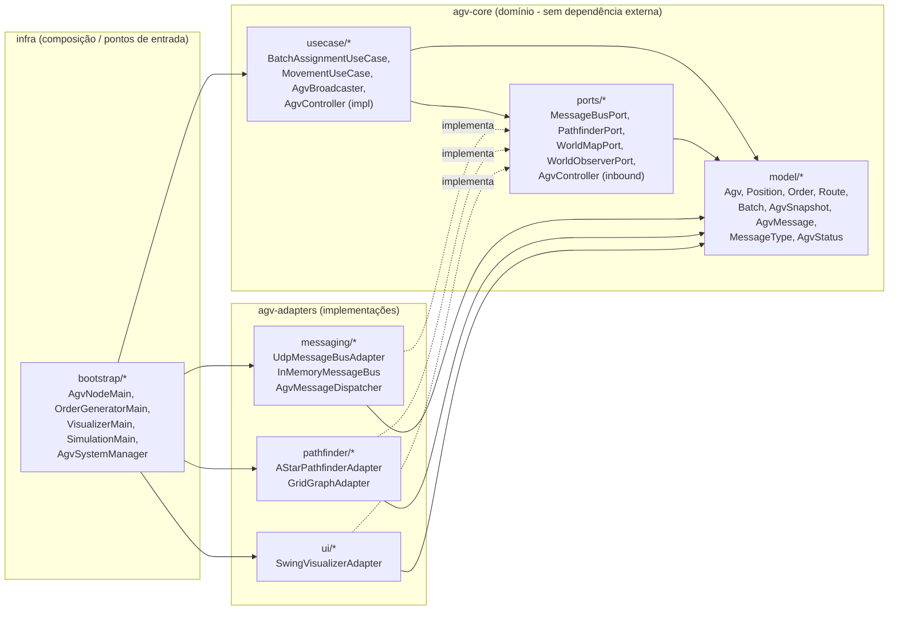
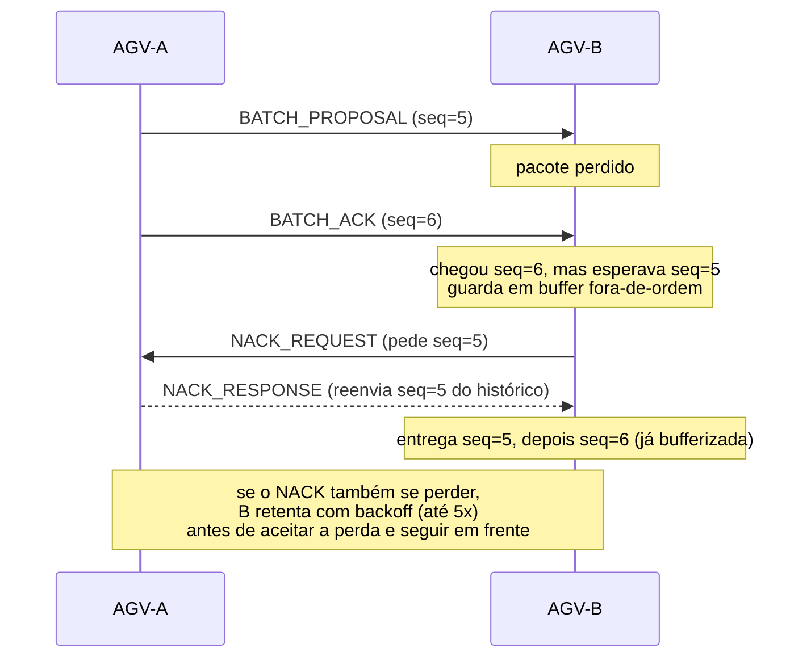
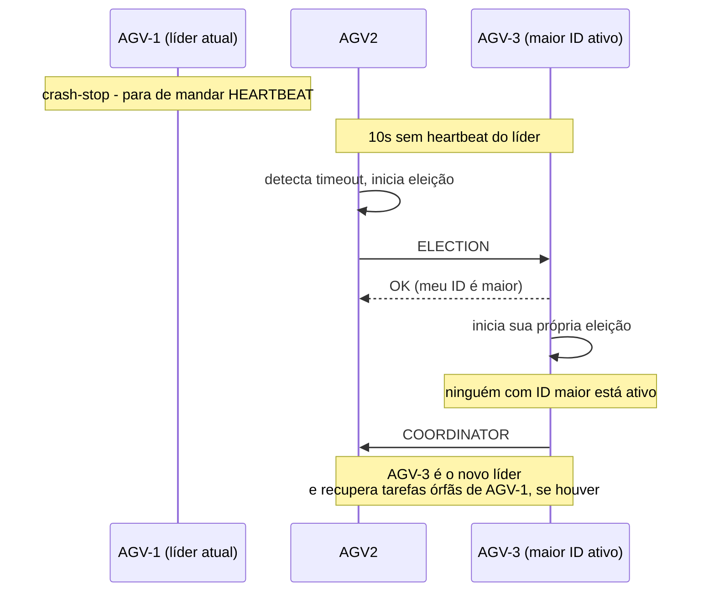
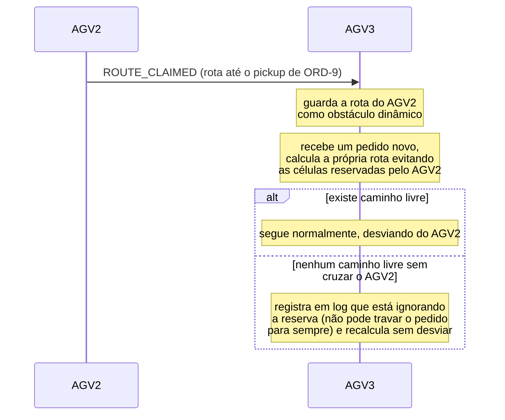

# Relatório Pós-implementação - EP_DSID

Este documento irá apresentar os resultados de implementação a partir do que foi proposto em `Especificacao_Grupo15.pdf`.

---

## 1. Introdução

Uma frota de AGVs decide sozinha - sem servidor central - quem pega qual pedido, coordenando-se por UDP Multicast com um protocolo próprio de confiabilidade (SRM), eleição de líder (Bully) e um algoritmo de leilão determinístico.

## 2. Arquitetura Hexagonal (Ports & Adapters)

A decisão mais estrutural do projeto foi separar regra de negócio (como um AGV decide o que fazer) de implementação (como essa decisão trafega pela rede, é desenhada na tela, ou vira um caminho).

Por exemplo, usamos uma única porta `MessageBusPort` (com `UdpMessageBusAdapter` para rede e `InMemoryMessageBus` para o modo de simulação) e o mesmo `BatchAssignmentUseCase`/`MovementUseCase` funciona com qualquer uma das duas, sem nenhuma modificação adicional.

---

## 3. Visão geral dos arquivos

Pode ser encontrado em [Guia de Arquivos - EP_DSID](./GUIA_DE_ARQUIVOS.md).

## 4. Decisões de projeto

Nossas decisões ao longo da implementação.

### 4.1 P2P puro

Nossa dúvida original era se um modelo pub/sub (com tópicos e assinaturas) se encaixaria melhor. A decisão foi não usar pub/sub: como o Gerador de Pedidos já precisa conhecer todos os nós por definição (para fazer broadcast), não haveria uso real para um pub/sub.

### 4.2 UDP Multicast + SRM implementados ao invés de biblioteca

Decisão da especificação (seção IV.B): usar sockets UDP crus e construir a confiabilidade na aplicação para aprender, visto que isso é um dos componentes principais para o funcionamento do nosso sistema proposto.

Para isso: cada mensagem tem número de sequência por remetente; perdas geram `NACK_REQUEST` e quem tem a mensagem no histórico responde com `NACK_RESPONSE`. Para entregar ainda mais confiabilidade, optamos por:

- **Retry com backoff no NACK** (até 5 tentativas): para que um único `NACK_REQUEST` ou `NACK_RESPONSE` perdido possa ser retransmitido mais algumas vezes, já que perdas em UDP são comuns
- **HEARTBEAT fora do histórico de retransmissão**: heartbeats são isentos de controle de sequência (não fazem sentido retransmitir essa mensagem caso esteja atrasada), então economizamos espaço no buffer limitado de mensagens retransmissíveis, como as de lote/proposta/pedido, que são as mensagens que realmente precisam da garantia.

### 4.3 Eleição por Bully

Quem tem o maior ID estático ativo vence.

### 4.4 Leilão

Nossa primeira discussão foi que cada AGV anunciasse sua distância e todos comparassem em tempo real - mas isso exige troca constante de mensagens e abre espaço para condição de corrida. A decisão tomada foi usar replicação de máquina de estado: o líder tira uum `snapshot` das posições de todos no momento da proposta, e cada AGV roda localmente o mesmo algoritmo determinístico (menor distância e desempate por menor ID) sobre os mesmos dados, chegando a um consenso sem trocar nenhuma mensagem extra - só a proposta e o ACK.

No fim, o `BATCH_ACK` indica a recepção da proposta, a partir daí os AGVs confiam totalmente na replicação de estado e no algoritmo determinístico para fazer a delegação dos pedidos para cada AGV.

### 4.5 Relógios de Lamport e Ordenação Total

Utilizamos Relógio de Lamport com um critério de desempate sendo o nome estático do AGV. Isso transforma ordenação causal em ordenação total, condição necessária para a replicação de máquina de estado funcionar (se cada nó pudesse ordenar os eventos de forma diferente, cada um chegaria a uma conclusão diferente sobre o vencedor do leilão).

### 4.6 Nomeação

Cada AGV tem um nome de configuração fixo (`AGV-1`) e um UUID gerado ao ligar, concatenados no `agvId`. O nome estático é o que importa para as decisões de negócio, já o UUID de sessão distingue uma sessão de outra do mesmo robô se ele cair e voltar (assim, os outros conseguem perceber e não confundir com o AGV antigo ainda ativo). A "resolução de nomes flat" (tabela `nameResolutionTable` dentro de `UdpMessageBusAdapter`) existe para que cada nó aprenda o endereço IP:porta dos outros simplesmente observando de onde vieram os pacotes de heartbeat que já recebeu (permitindo a descoberta de pares).

### 4.7 Navegação

O armazém é abstraído como matriz porque simplifica tanto a representação de obstáculos (estáticos e dinâmicos) quanto o cálculo de rota. A\* foi escolhido sobre BFS/Dijkstra por ser mais eficiente no nosso escopo (sem expandir muitos nós na busca).

### 4.8 Tolerância a falhas

O líder é responsável por recuperar tarefas órfãs. Para isso, ele utiliza a lista em memória (`activeAssignments`) dos pedidos correntes e quem estava encarregado. Quando o líder percebe (10s sem heartbeat) que um AGV com tarefa em andamento caiu, ele reintroduz o pedido no próximo lote, para ser disputado normalmente no próximo leilão.

- Todos os AGVs mantém seus respectivos mapas locais de `activeAssignments`. Além disso, quando um AGV conclui um pedido, todos os outros o removem em onOrderCompleted.
- Se o líder atual cair antes ou durante a tentativa de recuperar uma tarefa órfã:
  - Uma nova eleição acontece
  - Um novo AGV assume como líder coordenador
  - Ao se tornar líder, ele se encarrega de recuperar a tarefa que o outro líder estava encarregado.

Em mais detalhes, no método `recoverOrphanTasks()`, o novo líder faz o seguinte:

1. Varre o seu mapa local de `activeAssignments`.
2. Como o antigo líder caiu, ele não enviou mais batimentos cardíacos e, portanto, já foi removido de `activePeers`
3. Ao encontrar a linha correspondente ao antigo líder (ex: AGV-AntigoLider -> PedidoX), o novo líder detecta que o executor daquela tarefa não está mais ativo na rede.
4. Ele chama `BatchAssignmentUseCase.java` para esse nó morto, que:
   - Remove o pedido da lista de processados.
   - Adiciona o pedido de volta à fila de pendentes (pendingOrders).
   - Propõe um novo lote com este pedido reintroduzido.

Assim, com a replicação do mapa na memória de todos os nós, o pedido órfão é recuperado mesmo se quem caiu foi o próprio líder original.
Outro ponto de atenção são pedidos excedentes. Caso tenhamos 3 AGVs e 5 pedidos, o sistema precisa coordenar o primeiro lote (3 pedidos) e, após algum AGV concluir uma tarefa, imediatamente ser apto a receber um outro lote com os pedidos restantes.

- **Replicação de Pedidos Pendentes:** Ao receber um pedido, todos os AGVs (líder e backups) o armazenam em sua lista local `pendingOrders`. Quando o líder propõe um lote com sucesso, os backups limpam esses pedidos de suas filas em `onBatchProposal`, garantindo que o estado de pedidos pendentes seja replicado de forma consistente.
- **Retenção de Excedentes:** No leilão, se nenhum AGV estiver ocioso (`IDLE`) para assumir um determinado pedido, ele é mantido na fila `pendingOrders` local dos robôs
- **Coordenação baseada em Eventos de Liberação:** Sempre que um AGV passa a ficar `IDLE` (detectado por batimento cardíaco ou por pedido finalizado), o líder verifica se há pedidos pendentes em `pendingOrders` e, se houver, dispara imediatamente uma nova proposta de lote (`proposeBatch`), alocando os pedidos acumulados.

### 4.9 Threads

Na nossa camada de transporte, a thread que lê do socket UDP (`socket.receive`) só enfileira as mensagens recebidas. Uma outra thread é quem de fato processa cada mensagem, para que caso o processamento de uma mensagem demorar a leitura do socket não fique em atraso. Isso previne que o buffer de recepção do sistema operacional possa encher e descartar pacotes silenciosamente, um tipo de perda que a camada de aplicação (SRM) não tem como detectar nem recuperar.

### 4.10 Reserva Dinâmica por Rota

A prevenção de colisão entre AGVs tinha ficado como um opcional (fase futura). Estávamos entre pedir exclusão mútua a cada movimento unitário (caro em troca de mensagens) ou cada AGV guardar em memória as rotas correntes dos outros e só reservar deslocamento quando cruzar uma delas.
Aqui, tentamos seguir a segunda ideia: quando um AGV assume uma rota (`ROUTE_CLAIMED`), os outros passam a tratar as células dessa rota como obstáculo dinâmico ao calcular a própria. Quando ele libera a rota (`ROUTE_RELEASED`) ou cai (detectado por ausência de heartbeat), a reserva é esquecida.

Ainda assim, essa é uma reserva otimista que não possui garantia de zero colisão. A decisão foi nunca deixar um pedido travado esperando por um caminho perfeitamente livre, visto que o sistema aceita o risco e segue em frente, mas isso fica registrado em log (`"ROTA" ... recalculando sem desviar deles`).
