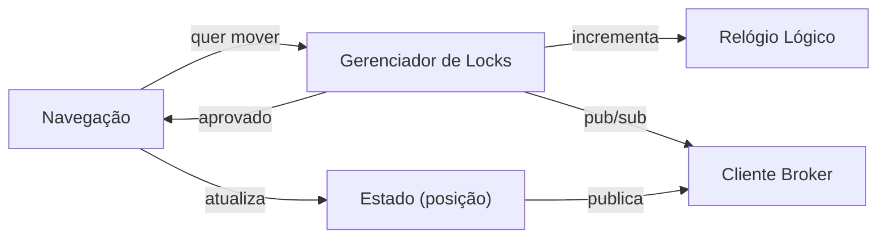
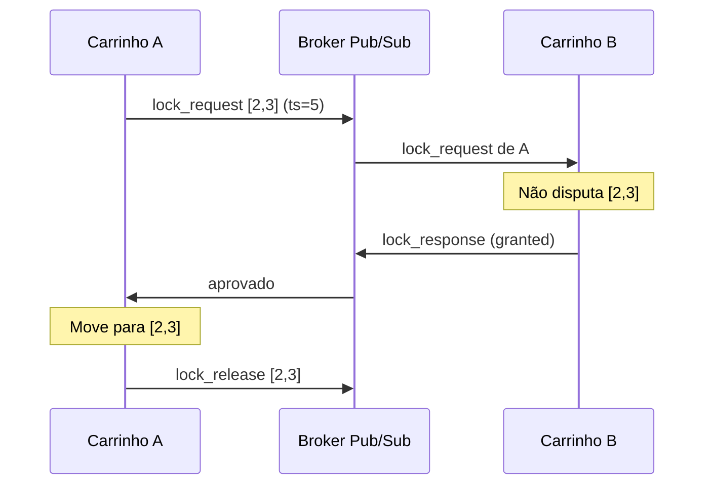
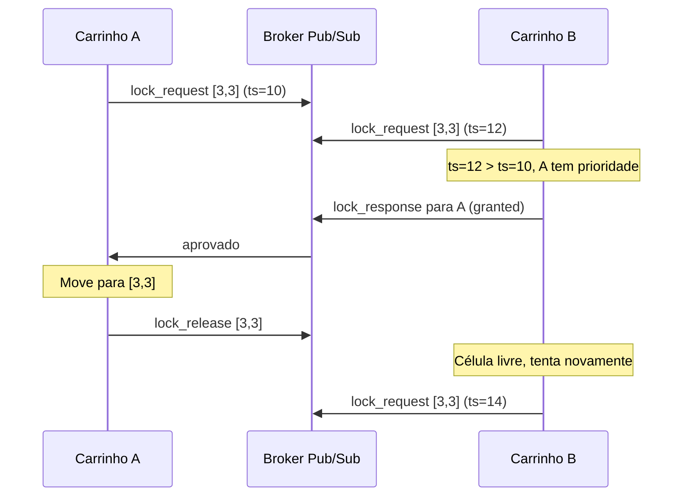
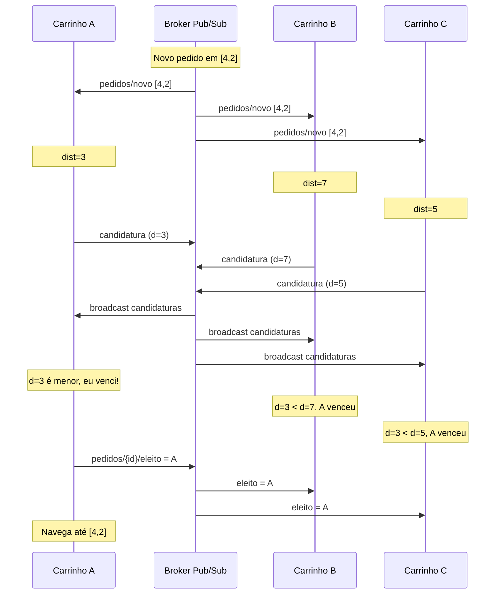
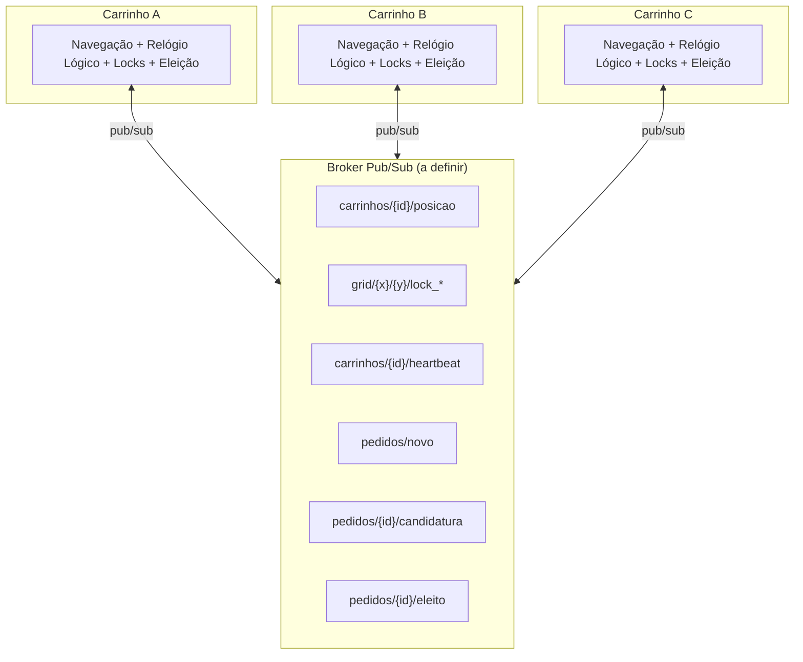

# Coordenação Distribuída de Agentes Autônomos com Exclusão Mútua via Broker Pub/Sub

## Índice

- [Contexto do Projeto](#ep---desenvolvimento-de-sistemas-de-informação-distribuídos): disciplina, escopo e visão geral do sistema
- [Protocolo de Operação](#como-funciona): como os carrinhos se coordenam
  - [Coordenação de Movimento](#movimentação): lock de células e navegação no grid
  - [Disputa por Pedidos via Eleição](#eleição-para-atribuição-de-pedidos): como os agentes competem para atender tarefas
- [Stack Tecnológico](#tecnologias): linguagem, broker e algoritmos candidatos
- [Arquitetura do Sistema](#arquitetura): estrutura de comunicação e componentes
  - [Canais de Comunicação do Broker](#tópicos-do-broker): hierarquia de tópicos pub/sub
  - [Módulos Internos de Cada Agente](#componentes-de-cada-carrinho): diagrama de componentes
  - [Fluxo Sem Contenção](#fluxo-normal-sem-conflito): sequência quando não há disputa por célula
  - [Resolução de Conflito](#conflito-mesma-célula): sequência quando dois agentes disputam a mesma célula
  - [Eleição para Atribuição de Pedido](#eleição-distribuída-disputa-por-pedido): sequência da disputa entre candidatos
  - [Topologia Geral](#visão-geral): diagrama de visão geral do sistema
  - [Garantias do Sistema](#propriedades-garantidas): safety, liveness, ordenação e tolerância a falhas

---

## EP - Desenvolvimento de Sistemas de Informação Distribuídos

Carrinhos autônomos navegam em um grid NxN sem colisões. Cada carrinho coordena seus movimentos com os demais via um **broker pub/sub** (a definir), usando um **algoritmo de exclusão mútua distribuída** (a definir) com relógios lógicos para desempate. Além da movimentação, o sistema utiliza um mecanismo de **eleição distribuída** para determinar qual carrinho atenderá cada novo pedido que surge no grid: quando um pedido é publicado, os carrinhos disponíveis disputam entre si através de um processo de eleição, e o vencedor assume a tarefa.

> **Nota:** O broker pub/sub e o algoritmo de exclusão mútua ainda serão definidos. Candidatos em avaliação:
>
> | Decisão | Candidatos |
> |---------|-----------|
> | Broker | MQTT (Mosquitto), RabbitMQ, Redis Pub/Sub, ZeroMQ |
> | Exclusão Mútua | Ricart-Agrawala, Maekawa, Token Ring, Lamport |
> | Relógio Lógico | Lamport, Vetorial |

## Como funciona

### Movimentação

1. Carrinho quer se mover para a célula `[x,y]`
2. Publica um `lock_request` com seu timestamp lógico
3. Os outros carrinhos respondem: aprovam se não querem a mesma célula, ou cedem prioridade ao menor timestamp
4. Com todas as aprovações, o carrinho se move e libera o lock

### Eleição para atribuição de pedidos

1. Um novo pedido é publicado no tópico `pedidos/novo`, contendo a célula de origem `[x,y]` e um identificador único
2. Cada carrinho disponível calcula sua **métrica de aptidão**
3. Cada candidato publica sua métrica no tópico `pedidos/{id}/candidatura`, dentro de uma janela de tempo
4. Após a janela, cada carrinho compara as métricas recebidas. O agente com a **menor métrica** (mais apto) vence. Empate: menor ID de processo
5. O vencedor publica confirmação em `pedidos/{id}/eleito` e navega até a célula do pedido

## Tecnologias

| Componente | Tecnologia |
|---|---|
| Comunicação | Broker Pub/Sub (a definir) |
| Linguagem | A definir (Python ou Java) |
| Sincronização | Relógio Lógico (a definir) |
| Exclusão Mútua | Algoritmo distribuído (a definir) |
| Eleição Distribuída | Algoritmo baseado em métrica (distância/carga) |

## Arquitetura

### Tópicos do Broker

> Os nomes de tópicos abaixo são ilustrativos. A estrutura será adaptada ao broker escolhido.

| Tópico | Descrição |
|--------|-----------|
| `carrinhos/{id}/posicao` | Broadcast da posição atual |
| `carrinhos/{id}/heartbeat` | Sinal de vida (detecta falhas) |
| `grid/{x}/{y}/lock_request` | Pedido de reserva de célula |
| `grid/{x}/{y}/lock_response` | Aprovação/negação do lock |
| `grid/{x}/{y}/lock_release` | Liberação da célula |
| `pedidos/novo` | Novo pedido publicado no grid |
| `pedidos/{id}/candidatura` | Candidatura de um carrinho ao pedido |
| `pedidos/{id}/eleito` | Resultado da eleição (vencedor) |

### Componentes de cada carrinho

### Fluxo normal (sem conflito)

### Conflito (mesma célula)

Quando dois carrinhos querem a mesma célula, o menor timestamp lógico tem prioridade. O perdedor aguarda a liberação e tenta novamente.

### Eleição distribuída (disputa por pedido)

Quando um novo pedido surge, os carrinhos disputam entre si para ver quem o atende. Cada um publica sua métrica de aptidão e o mais apto vence.

### Visão geral

### Propriedades garantidas

- **Segurança (safety):** no máximo um carrinho ocupa cada célula em qualquer instante
- **Vivacidade (liveness):** todo carrinho que solicita acesso a uma célula eventualmente obtém permissão
- **Ordenação causal:** os relógios lógicos garantem uma ordenação total compatível com a causalidade dos eventos
- **Distribuição autônoma de tarefas:** o mecanismo de eleição garante que pedidos são atribuídos ao agente mais apto sem intervenção central
- **Detecção de falhas:** o mecanismo de heartbeat permite identificar agentes inativos e evitar deadlocks
