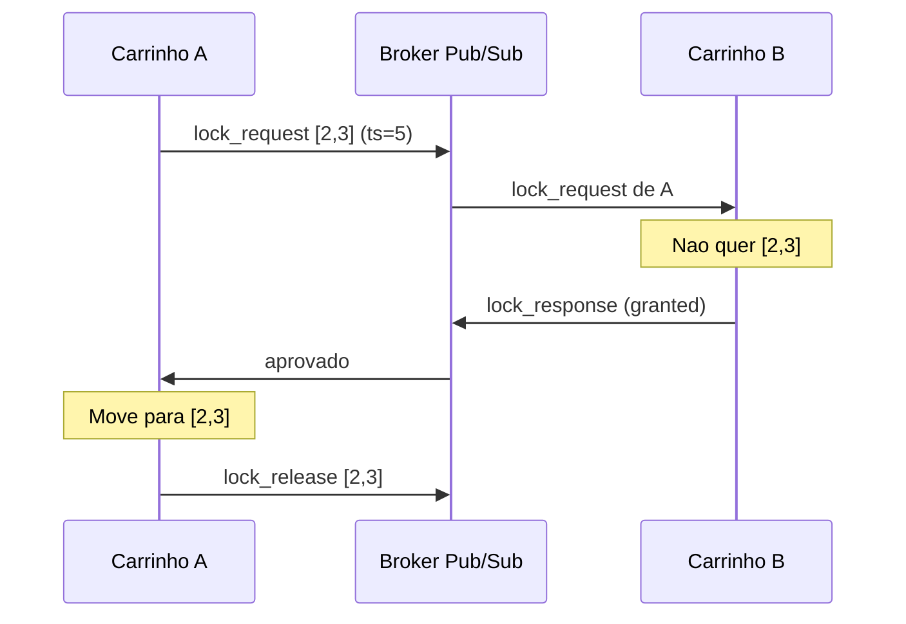
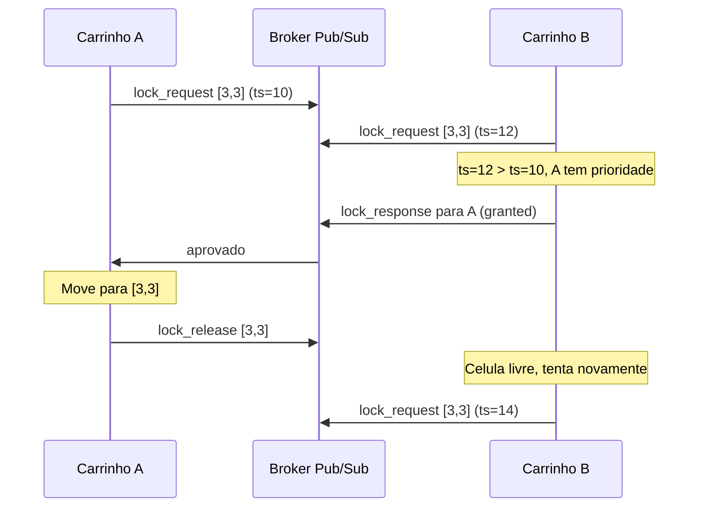

# Coordenacao Distribuida de Agentes Autonomos com Exclusao Mutua via Broker Pub/Sub

## EP - Desenvolvimento de Sistemas de Informacao Distribuidos

Carrinhos autonomos navegam em um grid NxN sem colisoes. Cada carrinho coordena seus movimentos com os demais via um **broker pub/sub** (a definir), usando um **algoritmo de exclusao mutua distribuida** (a definir) com relogios logicos para desempate. Alem da movimentacao, o sistema utiliza um mecanismo de **eleicao distribuida** para determinar qual carrinho atendera cada novo pedido que surge no grid: quando um pedido e publicado, os carrinhos disponiveis disputam entre si atraves de um processo de eleicao, e o vencedor assume a tarefa.

> **Nota:** O broker pub/sub e o algoritmo de exclusao mutua ainda serao definidos. Candidatos em avaliacao:
>
> | Decisao | Candidatos |
> |---------|-----------|
> | Broker | MQTT (Mosquitto), RabbitMQ, Redis Pub/Sub, ZeroMQ |
> | Exclusao Mutua | Ricart-Agrawala, Maekawa, Token Ring, Lamport |
> | Relogio Logico | Lamport, Vetorial |
>
> Os exemplos abaixo usam MQTT e Ricart-Agrawala como ilustracao, mas a arquitetura e independente dessas escolhas.

## Como funciona

### Movimentacao

1. Carrinho quer se mover para a celula `[x,y]`
2. Publica um `lock_request` com seu timestamp logico
3. Os outros carrinhos respondem: aprovam se nao querem a mesma celula, ou cedem prioridade ao menor timestamp
4. Com todas as aprovacoes, o carrinho se move e libera o lock

### Eleicao para atribuicao de pedidos

1. Um novo pedido e publicado no topico `pedidos/novo`, contendo a celula de origem `[x,y]` e um identificador unico
2. Cada carrinho disponivel calcula sua **metrica de aptidao** (ex: distancia Manhattan ate o pedido, carga atual, ou combinacao ponderada)
3. Cada candidato publica sua metrica no topico `pedidos/{id}/candidatura`, dentro de uma janela de tempo
4. Apos a janela, cada carrinho compara as metricas recebidas. O agente com a **menor metrica** (mais apto) vence. Empate: menor ID de processo
5. O vencedor publica confirmacao em `pedidos/{id}/eleito` e navega ate a celula do pedido

## Tecnologias

| Componente | Tecnologia |
|---|---|
| Comunicacao | Broker Pub/Sub (a definir) |
| Linguagem | Python |
| Sincronizacao | Relogio Logico (a definir) |
| Exclusao Mutua | Algoritmo distribuido (a definir) |
| Eleicao Distribuida | Algoritmo baseado em metrica (distancia/carga) |

## Arquitetura

### Topicos do Broker

> Os nomes de topicos abaixo sao ilustrativos (estilo MQTT). A estrutura sera adaptada ao broker escolhido.

| Topico | Descricao |
|--------|-----------|
| `carrinhos/{id}/posicao` | Broadcast da posicao atual |
| `carrinhos/{id}/heartbeat` | Sinal de vida (detecta falhas) |
| `grid/{x}/{y}/lock_request` | Pedido de reserva de celula |
| `grid/{x}/{y}/lock_response` | Aprovacao/negacao do lock |
| `grid/{x}/{y}/lock_release` | Liberacao da celula |
| `pedidos/novo` | Novo pedido publicado no grid |
| `pedidos/{id}/candidatura` | Candidatura de um carrinho ao pedido |
| `pedidos/{id}/eleito` | Resultado da eleicao (vencedor) |

### Componentes de cada carrinho

### Fluxo normal (sem conflito)

### Conflito (mesma celula)

Quando dois carrinhos querem a mesma celula, o menor timestamp logico tem prioridade. O perdedor aguarda a liberacao e tenta novamente.

### Eleicao distribuida (disputa por pedido)

Quando um novo pedido surge, os carrinhos disputam entre si para ver quem o atende. Cada um publica sua metrica de aptidao e o mais apto vence.

### Visao geral

### Propriedades garantidas

- **Seguranca (safety):** no maximo um carrinho ocupa cada celula em qualquer instante
- **Vivacidade (liveness):** todo carrinho que solicita acesso a uma celula eventualmente obtem permissao
- **Ordenacao causal:** os relogios logicos garantem uma ordenacao total compativel com a causalidade dos eventos
- **Distribuicao autonoma de tarefas:** o mecanismo de eleicao garante que pedidos sao atribuidos ao agente mais apto sem intervencao central
- **Deteccao de falhas:** o mecanismo de heartbeat permite identificar agentes inativos e evitar deadlocks
