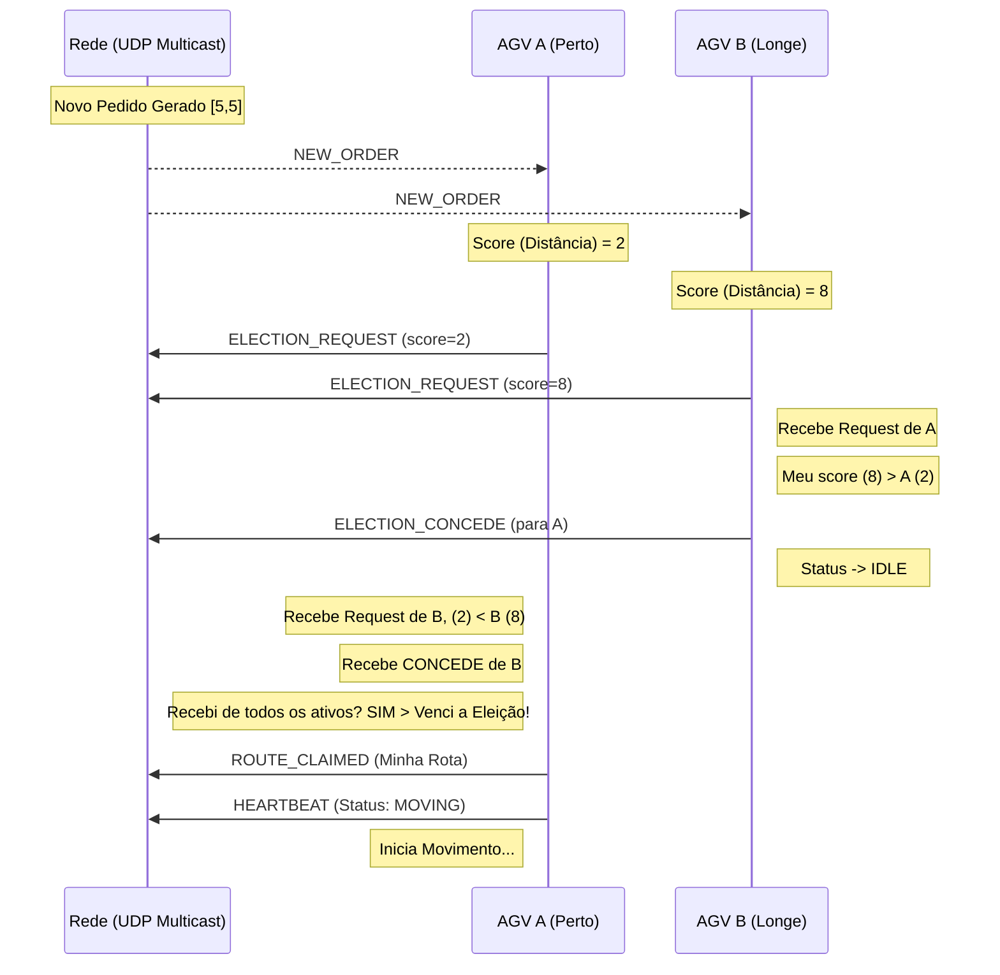

# Simulação de Frota de AGVs com Coordenação Totalmente Descentralizada

### Implementação de Eleição Distribuída e Comunicação P2P via UDP Multicast

- ❌ Ausência de Coordenador Central (**Zero SPOF**)
- 🧱 Arquitetura Hexagonal (**Ports & Adapters**)
- ⚡ Protocolo P2P de baixo nível para máxima performance

---

# Fundamentos da Comunicação

## O "Sistema Operacional" da Rede

- **Protocolo:** UDP Multicast (`230.0.0.1`)
- **Descoberta Dinâmica:** Heartbeats (1Hz)
  - Cada nó mantém uma **Liveness List** local
  - **Timeout de 5s** remove nós inativos
- **Serialização:** JSON via Jackson
  - Extensível
  - Interoperável

---

# Fluxo de Eleição (Diagrama)

<div class="flex justify-center items-start h-full">
  <div class="mermaid-container">



  </div>
</div>

<style>
.mermaid-container {
  transform: scale(1.5);
  transform-origin: top center;
}
</style>

---

# Funcionamento da Eleição

## Detalhes do Protocolo

1.  **Gatilho:** Publicação de `NEW_ORDER` via Multicast.
2.  **Candidatura:** AGVs `IDLE` calculam distância e emitem `ELECTION_REQUEST`.
3.  **Arbitragem Distribuída:**
    - Se o outro for **melhor** (menor distância): Envia `ELECTION_CONCEDE` e volta para `IDLE`.
    - Se o outro for **pior**: Re-envia candidatura (re-afirma prioridade).
    - **Empate:** Desempate pelo ID do AGV (ordem alfabética).
4.  **Vitória:** Considera-se eleito ao receber `CONCEDE` de todos os vizinhos ativos (Liveness List).
5.  **Execução:** Vencedor assume `MOVING`, calcula rota e notifica a rede.

---

# O Algoritmo de Eleição Distribuída

## Problema

Como decidir qual robô assume um pedido **sem servidor central**?

## Solução

Inspirado no **Bully Algorithm**, mas baseado em **Métrica de Aptidão**

1. Evento `NEW_ORDER` via broadcast
2. AGVs `IDLE` enviam `ELECTION_REQUEST` com seu **Score**
3. Cada nó compara seu Score com os recebidos
4. O mais apto aguarda `ELECTION_CONCEDE` de todos os vizinhos conhecidos

---

# Lógica de Decisão e Desempate

## O "Cérebro" do Consenso

- **Métrica Primária:** Distância de Manhattan até o Pickup
  - Minimiza tempo de resposta e consumo de energia
- **Desempate:** ID do processo (ordem lexicográfica)
  - Garante decisão única (**Safety**)
- **Resultado:**
  - Vencedor → `MOVING`
  - Demais → `IDLE`

---

# Visualização e Monitoramento

## Observabilidade em Sistemas Distribuídos

- **Network Observer**
  - Escuta a rede e consolida estados
- **Interpolação Suave (LERP)**
  - Eventos discretos → movimento contínuo
- **Visão de Rotas**
  - Renderização apenas do **Path Remaining**
  - Validação visual do A\*

---

# Conclusão e Resultados

## O que validamos?

- ✅ Descentralização real (escala horizontal)
- ✅ Concorrência com múltiplos pedidos (`/multi_order`, `/random_orders`)
- ✅ Robustez com entrada/saída dinâmica de nós

---

# Arquitetura Hexagonal (Ports & Adapters)

## Conceito Central: Independência de Tecnologia

- **agv-core**
  - Regras puras de negócio (AGV, Rotas, Eleição)
- **Ports (Interfaces)**
  - `MessageBusPort`, `PathfinderPort`
- **Adapters (Implementações)**
  - `UdpMessageBusAdapter`
  - Possível trocar por Kafka **sem tocar no Core**

---

# Estrutura de Módulos (Maven)

## Organização do Workspace

### agv-core — "O Cérebro"

- `model/` → Records imutáveis
- `usecase/` → ElectionUseCase, MovementUseCase
- `ports/` → Interfaces

### agv-adapters — "A Casca"

- `messaging/` → UDP + Jackson
- `pathfinder/` → A\* via JGraphT
- `ui/` → Swing

### infra — "O Montador"

- `bootstrap/` → Classes `Main` que plugam tudo

---

# O Ciclo de Vida de uma Mensagem

## Fluxo Desacoplado

1. `UdpMessageBusAdapter` recebe pacote UDP
2. JSON → `AgvMessage`
3. `AgvController` roteia para o Use Case
4. `ElectionUseCase` processa
5. `MessageBusPort.broadcast()` envia de volta à rede

---

# Relacionamento de Arquivos Chave

## Mapa Mental do Sistema

- **AgvController** → Orquestra Eleição e Movimento
- **ElectionUseCase** → Estado: `IDLE → ELECTING → WON/LOST`
- **NetworkObserverAdapter** → Observabilidade externa
- **OrderGeneratorMain** → Produtor de eventos

```

```
